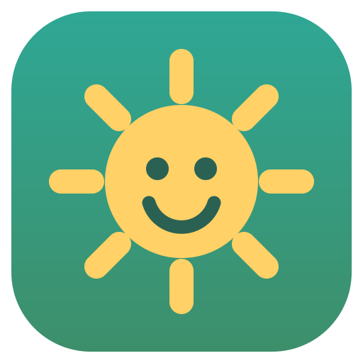
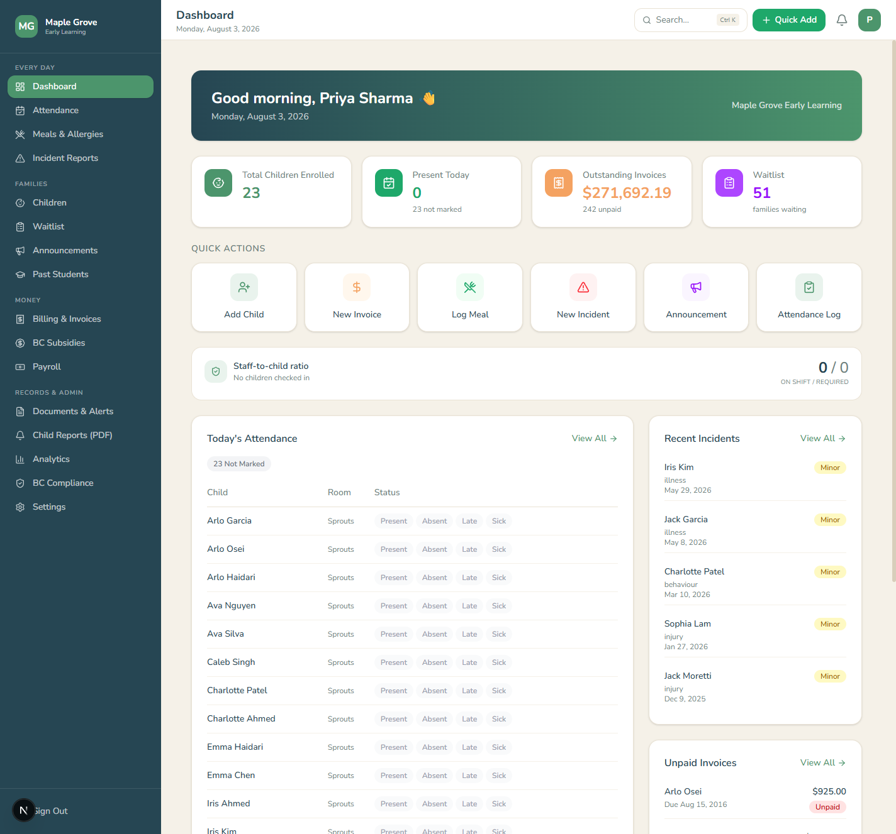
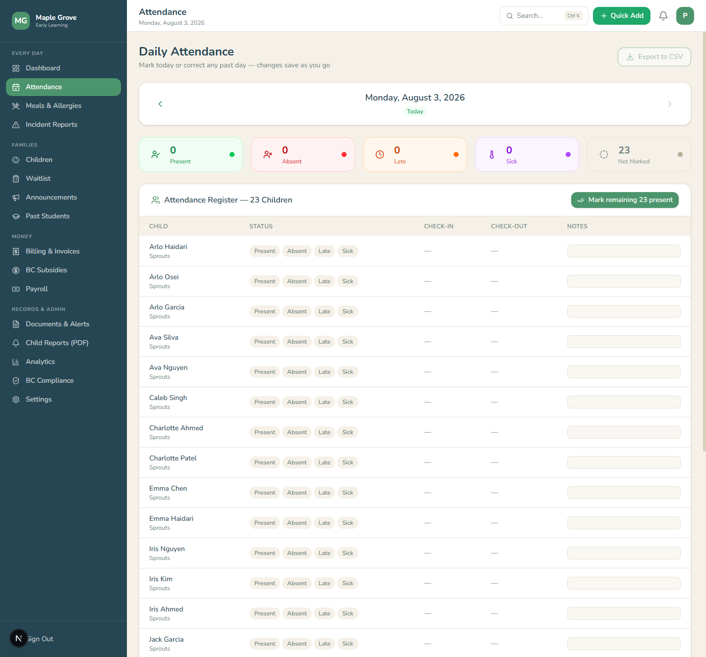
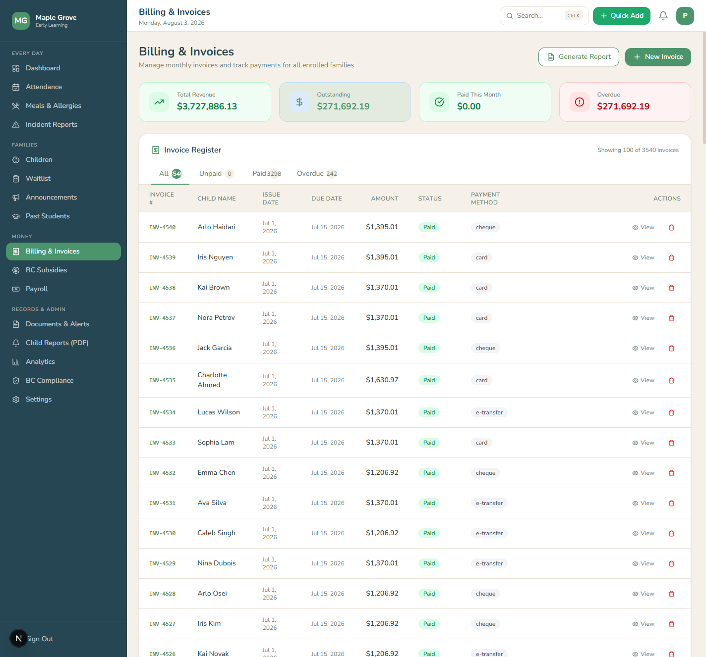
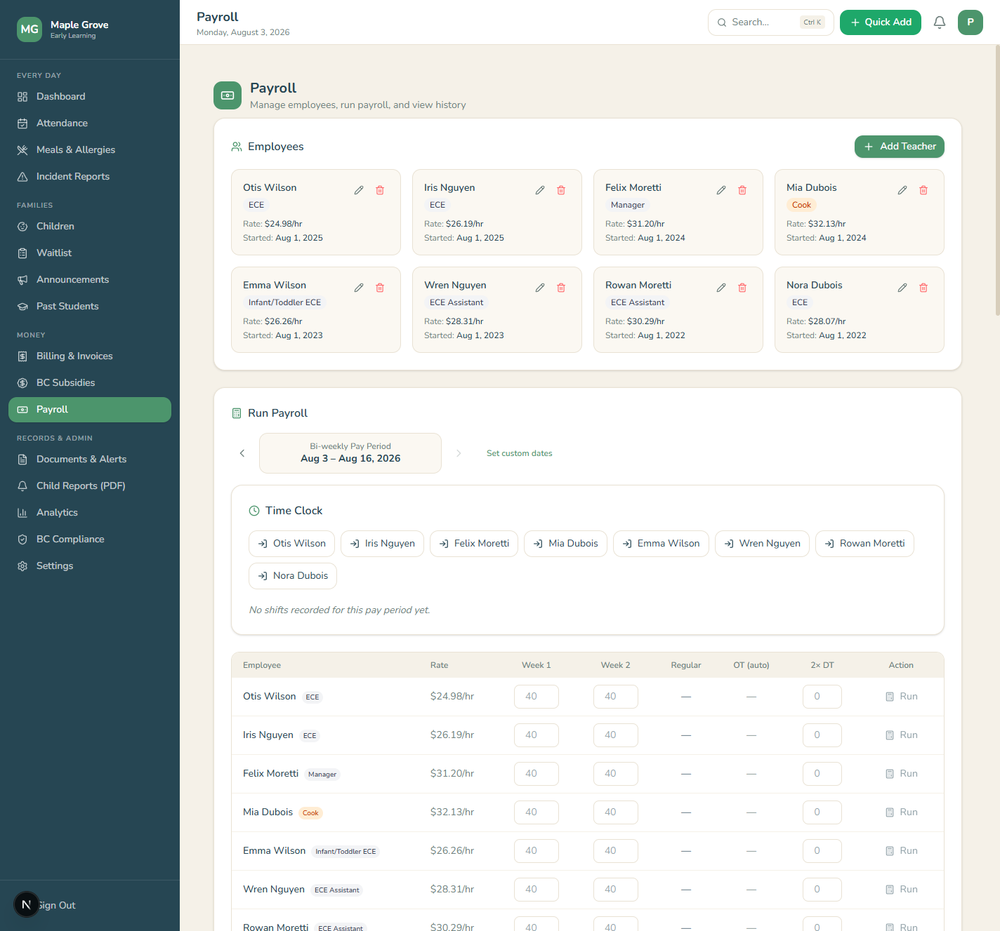
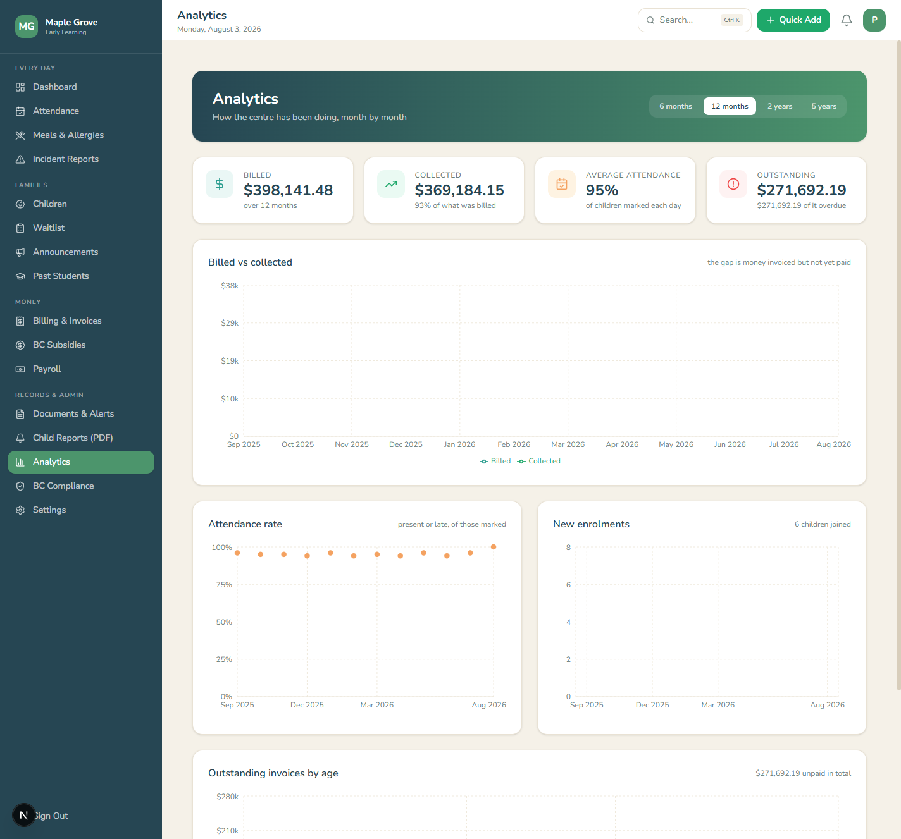
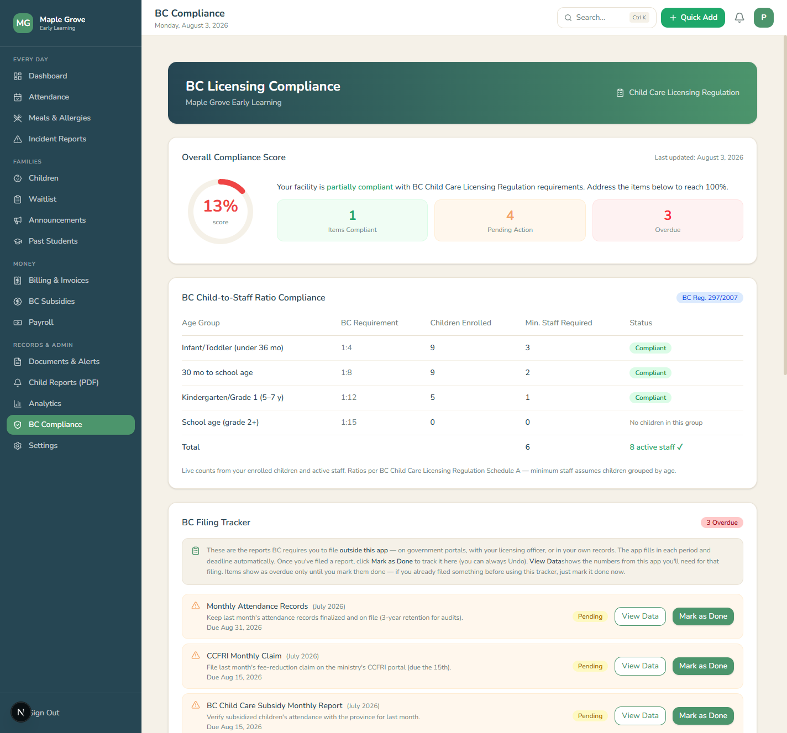

<p align="center"></p>

<h1 align="center">Daybook DMS</h1>
<p align="center"><b>All-in-one, offline, encrypted daycare management software for Windows.</b><br>
Built for my family's childcare centre — a good fit for small daycares.</p>

<p align="center">


</p>

> **Showcase repository.** Daybook's source code is private. Screenshots below use simulated demo data only.



## What it is

Daybook started as the admin system for **Smart Thinkers Childcare Centre** (Vancouver, BC), replacing paper, spreadsheets and disconnected tools. The desktop edition is a Windows app suited to other small daycares. Children's records, attendance, billing, payroll, BC compliance and parent communication live in one program — with data encrypted on the centre's own PC.

## Highlights

- **8 releases · 111 commits · 22 data models**
- Validated with a **10-year simulation** — 82 children, 26 staff, 73,900+ attendance records, 3,500+ invoices — **33/33 integrity checks passed**
- **Encryption at rest** + **AES-256-GCM encrypted backups** with a recovery code
- **BC payroll engine** — bi-weekly periods, overtime, 2026 federal/BC tax, CPP/CPP2/EI, printable pay stubs
- One-click installer with **auto-updates**

## Features

| Every day | Families | Money | Records & admin |
|---|---|---|---|
| Dashboard | Child profiles (medical, allergies, custody, pickups) | Invoicing & overdue tracking | BC compliance exports |
| Smart attendance | Waitlist pipeline | BC subsidy tracking | Document store |
| Allergy-aware meal log | Parent announcements (email) | Payroll & pay stubs | Printable child reports |
| Incident reports | Past-students archive | Staff time clock & ratios | Analytics · Audit log |

## Screenshots

| Attendance | Billing |
|---|---|
|  |  |
| **Payroll** | **Analytics** |
|  |  |



## Architecture

```
 Next.js 16 + React 19 UI ──► Electron 37 shell (NSIS installer, auto-update)
            │
            ▼
 Prisma 7 ──► SQLite (encrypted, local %APPDATA%) ──► AES-256-GCM .daybook backups
```

## Tech

Next.js 16 · React 19 · TypeScript · Tailwind v4 · Electron 37 · Prisma 7 · SQLite (encrypted) · AES-256-GCM · built with Claude Code

---

Built by **Lambert Badong** · [GitHub](https://github.com/LambertBadong)
